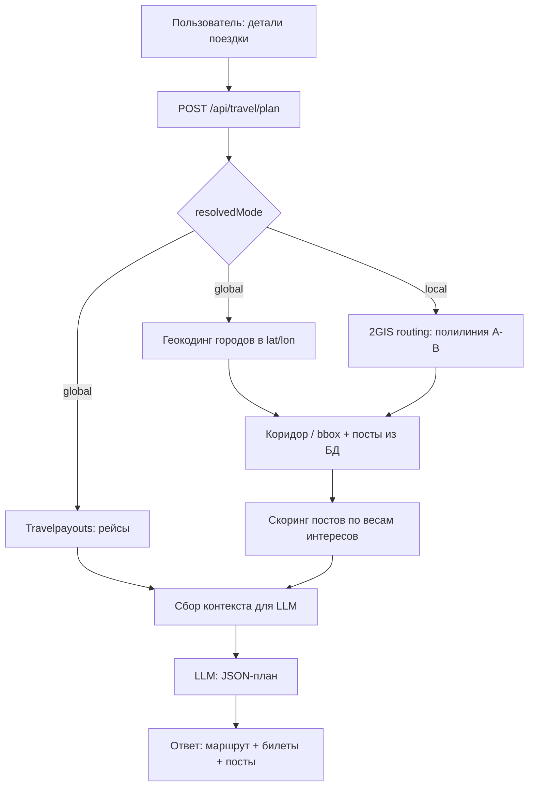

# Путешествия: глобал / локал, маршрут, авиабилеты, интересы с весами и LLM

Документ описывает **конкретную** реализацию флоу: что уже есть в репозитории, что добавить, как сделать так, чтобы результат был **воспроизводимым** (не «магия нейросети»), а учёт интересов с весами — **формально проверяемым** в коде.

---

## 1. Цель продукта

1. Пользователь вводит **детали путешествия** (откуда, куда, даты, бюджет/темп, тип транспорта и т.д.).
2. Система определяет **режим**: **глобальный** (между городами/странами, опора на перелёты) или **локальный** (в пределах города/агломерации, опора на наземный маршрут).
3. Бэкенд собирает **факты о маршруте** (дистанции, время, геометрия при необходимости, варианты авиабилетов для глобала).
4. Подтягиваются **кандидаты точек из вашей БД** (посты/места с `geo_lat` / `geo_lng` и связью с интересами через `post_interests`).
5. **Веса интересов пользователя** (`user_interests.weight`) участвуют в **ранжировании** кандидатов **детерминированно** (SQL/код), чтобы «нейросеть учитывала интересы» не словами, а поверх уже посчитанных скоров.
6. **LLM** получает структурированный контекст и возвращает **строгий JSON** — порядок дней, подписи, объяснения, ссылки только на `post_id` из переданного списка (никаких выдуманных мест).

Так вы получаете **100% предсказуемую** часть (данные + скоринг) и **контролируемую** часть (LLM только упаковывает и комментирует уже валидные сущности).

---

## 2. Что уже есть в коде (опора)

| Компонент | Где | Назначение |
|-----------|-----|------------|
| Посты с координатами | `app/models/post.py` — `geo_lat`, `geo_lng` | Точки на карте |
| Интересы у поста | `post_interests` | `interest_id` ↔ `post_id` |
| Интересы и **веса** у пользователя | `user_interests` — колонка `weight` | Уже используется в ленте |
| Сумма весов по пересечению интересов поста и юзера | `FeedService._personal_scores` в `app/services/feed_service.py` | Готовый паттерн: `sum(user_interests.weight)` по совпадающим `interest_id` |
| Авиабилеты (глобал) | `TravelService.get_global_route` → Travelpayouts `prices_for_dates` | `app/services/travel_service.py`, роут `GET /api/global` в `app/api/travel.py` |
| Матрица расстояний/времени 2GIS | `TravelService.get_route_matrix_info` → `get_dist_matrix` | `POST /api/route_matrix_info` |
| POI вдоль полилинии (не дорожный роутер A→B) | `get_route_full_info` — гаверсинус по точкам + 2GIS Catalog / DaData / Wikipedia | Для локального «обогащения» опционально |
| Настройки LLM | `app/core/config.py` — `GPT_CLIENT_BASE_URL`, `GPT_CLIENT_KEY`, `GPT_MODEL` | Клиент к OpenAI-совместимому API |

**Важно:** для локального маршрута «по дорогам A→B» в документации 2GIS описан **Routing API** `POST …/routing/7.0.0/global` (геометрия в `maneuvers[].outcoming_path.geometry[].selection` как WKT `LINESTRING`). Сейчас в проекте вызывается в основном `get_dist_matrix` — **полилинию для коридора отбора постов** нужно добавить отдельным методом (см. раздел 5).

---

## 3. Два вида путешествий: правила классификации

Нужна **однозначная** функция на бэкенде (без «пусть LLM решит режим» как единственный источник истины).

### 3.1. Ввод пользователя (минимальный контракт)

Рекомендуемое тело запроса (новый эндпоинт, см. §7):

```json
{
  "modeHint": "auto",
  "origin": { "type": "city", "name": "Москва", "lat": null, "lon": null },
  "destination": { "type": "city", "name": "Казань", "lat": null, "lon": null },
  "startDate": "2025-06-01",
  "endDate": "2025-06-07",
  "pace": "relaxed",
  "budgetNote": "умеренный",
  "transportPreference": "public_transport"
}
```

- `modeHint`: `"global"` | `"local"` | `"auto"`.

### 3.2. Алгоритм `auto` (детерминированно)

1. Если **разные страны** (если появится поле страны или геокодинг) → **global**.
2. Иначе если расстояние между центроидами origin/destination (геокодер или координаты) **> порога** (например **300 км**) → **global**.
3. Иначе если пользователь явно указал **перелёт** или время в пути наземным транспортом по матрице 2GIS **> 6 ч** при `transport = driving` → **global** (настраиваемые константы в `settings`).
4. Иначе → **local**.

Итог режима пишется в ответ API (`resolvedMode: "global" | "local"`), чтобы фронт и аналитика видели решение.

---

## 4. Конвейер данных (end-to-end)



---

## 5. Факты маршрута для LLM (обязательные поля)

LLM **не должна** выдумывать расстояния и цены. Ей передаётся объект `routeFacts`:

### 5.1. Global

- `flights`: топ-N ответа `get_global_route` (уже есть структура `CheapFlightsResponseDTO`): цена, аэропорты, даты, длительность, пересадки.
- `groundSegments`: опционально для «добраться до аэропорта» — короткие вызовы 2GIS `get_dist_matrix` между точками, если есть координаты.
- `cities`: нормализованные названия origin/destination.

### 5.2. Local

- `routing`: `total_distance_m`, `total_duration_s`, `reliability` из 2GIS.
- `polyline`: список `{ "lat", "lon" }` (упрощённый, с лимитом вершин, например ≤ 500, чтобы не раздувать промпт).
- `postsCandidates`: см. §6.

---

## 6. Учёт интересов с весами: детерминированный скоринг (обязательно)

### 6.1. Формула (как в ленте)

Для каждого поста-кандидата `post_id`:

\[
\text{interestScore}(post) = \sum_{i \in I_{post} \cap I_{user}} w_{user}(i)
\]

где \(w_{user}(i)\) — `user_interests.weight` для пары `(user_id, interest_id)`.

Это **то же семантическое ядро**, что в `FeedService._personal_scores` (`func.sum(user_interests.c.weight)` по join `post_interests` ↔ `user_interests`).

### 6.2. Расширение (опционально, но прозрачно)

Добавить в итоговый скор поста (все коэффициенты — константы в коде):

- `proximityScore` — убывание от расстояния до маршрута (метры до полилинии или до линии «как ворона летит» для global без полилинии).
- `ratingBoost` — средний рейтинг отзывов (как в `FeedService._engagement_maps`).
- `favoriteBoost` — популярность по избранному.

Итог:

```text
finalScore = a * interestScore + b * proximityScore + c * ratingBoost + d * log(1 + favCount)
```

Конкретные `a,b,c,d` подбираются эмпирически; **главное** — `interestScore` всегда считается в Python/SQL, а не «на глаз» в LLM.

### 6.3. Что передаётся в LLM по каждому кандидату

Минимум:

```json
{
  "postId": 42,
  "title": "...",
  "city": "...",
  "lat": 55.75,
  "lon": 37.62,
  "interestIds": [1, 3],
  "interestScore": 57,
  "finalScore": 132.4,
  "avgRating": 4.6,
  "distanceFromRouteM": 850
}
```

Плюс отдельным блоком словарь интересов пользователя:

```json
{
  "userInterests": [
    { "interestId": 1, "name": "Архитектура", "weight": 50 },
    { "interestId": 2, "name": "Кофе", "weight": 5 }
  ]
}
```

Тогда модель **видит веса** и может объяснять пользователю «поставили X выше из‑за вашего сильного интереса к архитектуре», но **выбор топ-K по скору** уже сделан кодом.

---

## 7. Роль LLM: только структурированный вывод

### 7.1. Системный промпт (смысл)

- Ты планировщик поездки.
- Используй **только** `postsCandidates[].postId` из контекста для мест из приложения.
- Рейсы — **только** из `flights` (глобал).
- Расстояния/время наземного пути — **только** из `routeFacts`.
- Если данных не хватает — укажи `warnings[]`, не выдумывай координаты и цены.

### 7.2. JSON Schema ответа (пример)

```json
{
  "title": "string",
  "resolvedMode": "global",
  "summary": "string",
  "days": [
    {
      "dayIndex": 1,
      "theme": "string",
      "blocks": [
        {
          "kind": "flight",
          "ref": { "offerIndex": 0 }
        },
        {
          "kind": "place",
          "ref": { "postId": 42 },
          "note": "почему это место логично в этот день"
        }
      ]
    }
  ],
  "warnings": ["string"]
}
```

- `offerIndex` — индекс в массиве `flights`, который вы сами передали.
- Валидация на бэкенде: после ответа LLM прогнать проверку, что все `postId` ∈ исходного множества; иначе retry или отбросить невалидные блоки.

### 7.3. Вызов API

Использовать существующие `GPT_*` настройки; запрос с `response_format: { "type": "json_object" }` (или JSON Schema, если провайдер поддерживает). Температура низкая (0.2–0.4).

---

## 8. Новые/изменяемые части бэкенда (чеклист)

| # | Задача | Где |
|---|--------|-----|
| 1 | Эндпоинт `POST /api/travel/plan` (или `/api/user/travel/plan` с `get_current_user`) | `app/api/travel.py` |
| 2 | Сервис оркестрации: режим, вызов Travel + 2GIS, выборка постов | `app/services/travel_plan_service.py` (новый) |
| 3 | Метод 2GIS `routing/7.0.0/global` → полилиния | `TravelService` |
| 4 | Выборка постов в коридоре (bbox + отсечение по расстоянию до полилинии) | `PostService` или в том же план-сервисе |
| 5 | Функция скоринга: веса интересов + дистанция + рейтинг | переиспользовать SQL из `_personal_scores`, добавить метрики |
| 6 | Сбор промпта + вызов OpenAI-совместимого клиента | новый `LlmTravelPlanner` / `app/services/gpt_*.py` |
| 7 | Pydantic-модели запроса/ответа + валидация ответа LLM | `app/api/travel.py` или `app/schemas/travel_plan.py` |
| 8 | Тесты: скоринг без сети; мок 2GIS/LLM | `backend/tests/` |

---

## 9. Почему это «не абстрактно»

1. **Режим** путешествия задаётся правилами и попадает в ответ как `resolvedMode`.
2. **Билеты** в глобале — из реального API (уже интегрировано).
3. **Места из базы** — только с валидными `postId` и координатами; попадание «по пути» — геометрия + порог метров (код).
4. **Интересы с весами** — формула и SQL как в ленте; LLM получает числа и имена, но не определяет веса заново.
5. **LLM** ограничена схемой и пост-валидацией; при сбое — откат к «сырому» списку топ-K постов по `finalScore` без narrative.

---

## 10. Зависимости и риски

- **Ключи:** `TRAVEL_API_KEY`, `TGIS_API_KEY` должны быть валидны для Routing API (в облаке 2GIS методы Routing доступны публично по их документации).
- **Посты без координат** не попадают в коридор; для города можно отдельный режим «радиус от центра» без полилинии.
- **Стоимость LLM:** ограничивать размер `postsCandidates` (например топ 40 после скоринга) и усечь полилинию.

---

## 11. Краткая последовательность для фронта

1. Пользователь заполняет форму → `POST /api/travel/plan` с токеном пользователя.
2. UI показывает `resolvedMode`, карточки билетов (если global), дни и места.
3. При клике на место — переход на существующий экран поста по `postId`.

Этого достаточно, чтобы реализация была пошаговой, проверяемой и согласованной с текущей моделью данных в **kraeved**.
